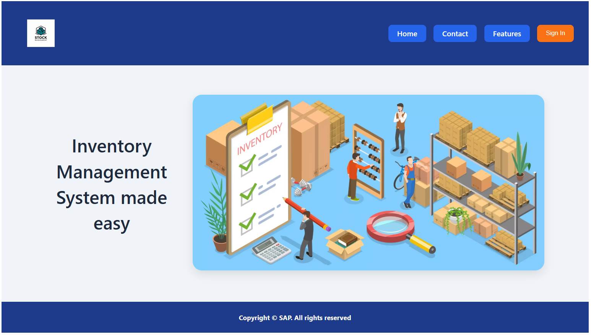
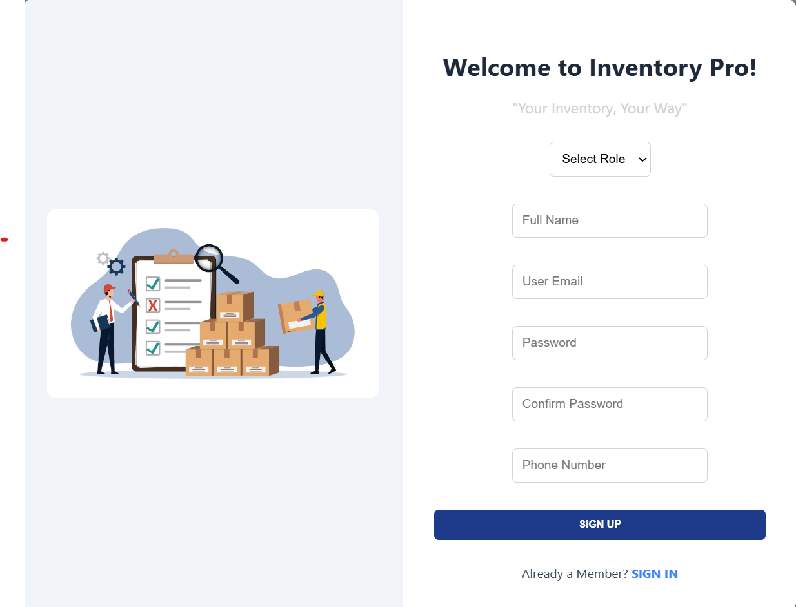
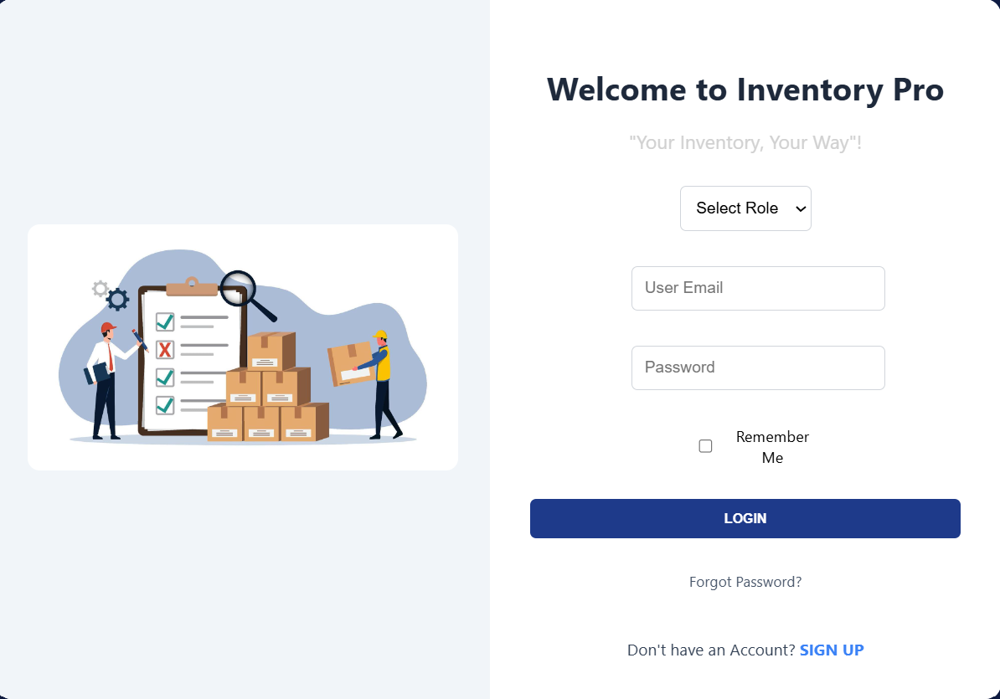
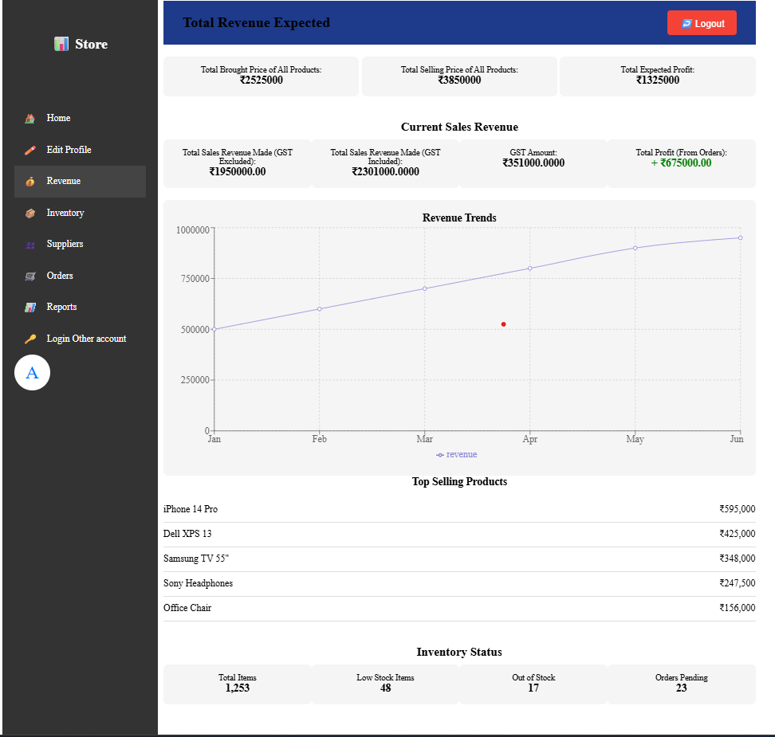

# Inventory Management System 🚀

A full-stack **Inventory Management System** built with:

- ⚙️ **Backend** – Java 17, Spring Boot, Spring Data JPA, MySQL  
- 🎨 **Frontend** – React 18 (Vite)  
- 📦 **Database** – MySQL (Local or Railway)  
- ☁️ **Deployment** – Render (Backend), Railway (DB), GitHub  

This project allows users to register, sign in, and (coming soon) manage inventory items like products, categories, and suppliers — with a clean UI and secure API.

---

## ✨ Features

| Module         | Feature                                  | Status     |
|----------------|-------------------------------------------|------------|
| Authentication | User Sign-Up & Login (JWT-based)          | ✅ Done     |
| Email          | Gmail SMTP Password Recovery              | ✅ Done     |
| Database       | MySQL Integration                         | ✅ Done     |
| Inventory      | Product/Supplier CRUD                     | ⏳ Planned  |
| Frontend UI    | React Dashboard with Tailwind             | ⏳ Planned  |
| Cloud          | Deployment via Render/Railway             | ✅ Working  |
| CI/CD          | GitHub Actions / Auto Deploy              | ✅ Working  |

---

## 📁 Project Structure

```
InventoryManagmentSystem/
├── Backend/
│   └── InventoryManagementSystem/
│       ├── src/
│       │   ├── main/java/ims/
│       │   │   ├── controller/
│       │   │   ├── model/
│       │   │   ├── repository/
│       │   │   └── InventoryManagementSystemApplication.java
│       │   └── resources/
│       │       └── application.properties
│       ├── pom.xml
│       └── inventory.sql
├── Frontend/
│   └── InventoryManagementSystem/
│       ├── src/
│       ├── public/
│       └── package.json
└── README.md
```

---

## 📸 Screenshots

| 📌 Page        | 🖼️ Screenshot |
|----------------|--------------|
| **Home**       |  |
| **Sign‑Up**    |  |
| **Sign‑In**    |  |
| **Dashboard**  |  |


---

## 🧩 Prerequisites

| Tool      | Required Version |
|-----------|------------------|
| Java      | 17+              |
| Maven     | 3.8+             |
| Node.js   | 18 LTS           |
| MySQL     | 8.x              |
| Git       | Latest           |

---

## ⚙️ Local Setup

### 1. Clone the Repository

```bash
git clone https://github.com/LakshmiPravalika79/InventoryManagmentSystem.git
cd InventoryManagmentSystem
```

---

### 2. MySQL Database

```sql
CREATE DATABASE inventorymanagement;
```

> Spring Boot auto-creates tables because `spring.jpa.hibernate.ddl-auto=update`.

---

### 3. Environment Configuration

Create a `.env` file (or use `application.properties`) with the following:

```env
# ─── SPRING ────────────────────────
SPRING_DATASOURCE_URL=jdbc:mysql://localhost:3306/inventorymanagement
SPRING_DATASOURCE_USERNAME=your_username
SPRING_DATASOURCE_PASSWORD=your_password

SPRING_MAIL_USERNAME=your_email@gmail.com
SPRING_MAIL_PASSWORD=your_gmail_app_password

JWT_SECRET=anylongrandomstringsecret

# ─── FRONTEND ─────────────────────
VITE_API_BASE_URL=http://localhost:8080
```

❗ **Never commit real secrets.** Use `.env` or set environment variables in Render/Railway.

---

### 4. Run Backend

```bash
cd Backend/InventoryManagementSystem
mvn spring-boot:run
```

Your backend will be live at: `http://localhost:8080`

---

### 5. Run Frontend

```bash
cd Frontend/InventoryManagementSystem
npm install
npm run dev
```

Your frontend will be live at: `http://localhost:5173`

---

## 🔌 API Endpoints

| Method | Endpoint         | Description             |
|--------|------------------|-------------------------|
| POST   | `/users/signup`  | Register a new user     |
| POST   | `/users/signin`  | User login              |
| GET    | `/users/{id}`    | Fetch user by ID (TBD)  |

---

## 🧪 Run Tests

```bash
cd Backend/InventoryManagementSystem
mvn test
```

---


## 📬 Connect

**Lakshmi Pravalika**  
## 🔗 Connect with Me

[](https://github.com/LakshmiPravalika79)
[](https://linkedin.com/in/lakshmipravalikaega/)
[](mailto:egalakshmipravalika458@gmail.com)


---

## 📝 License

Distributed under the [MIT License](LICENSE).

> ✨ Thank you for checking out this project! Contributions and stars are welcome 🌟
